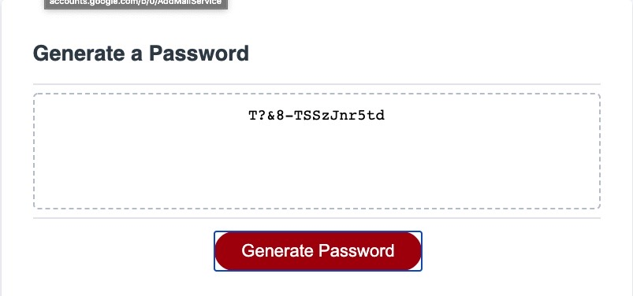

# 03 JavaScript: Password Generator

This application generates a random password based on user-selected criteria. This app will run in the browser and feature dynamically updated HTML and CSS powered by JavaScript. It features a clean and polished user interface and is also responsive, ensuring that it adapts to multiple screen sizes.

The following images demonstrate the application functionality:

 
 
 

 